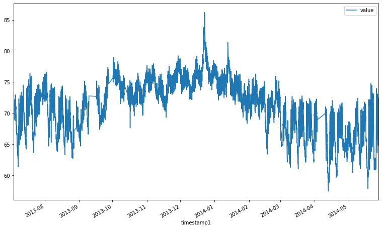
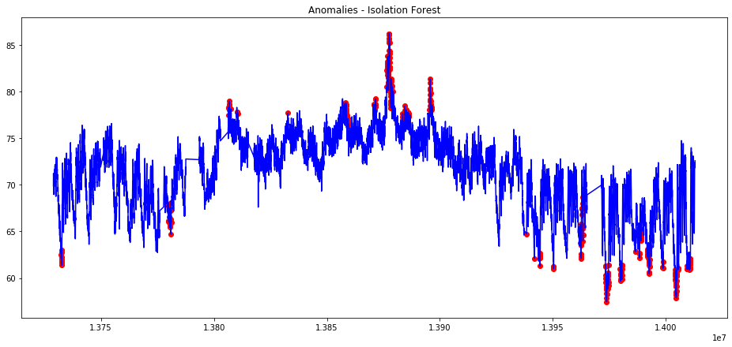
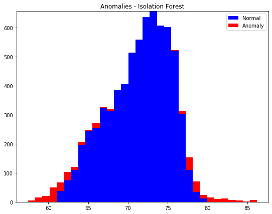
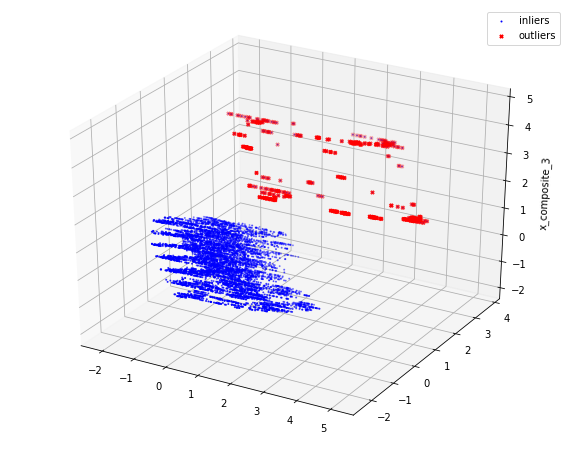
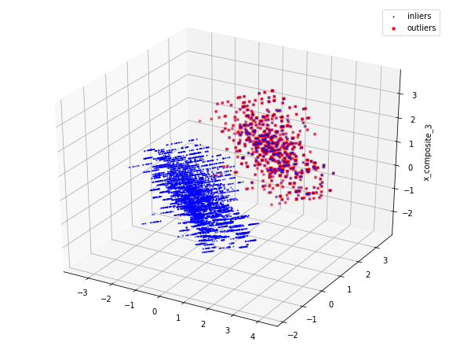

NAB
==============================

Anomoly detection on NAB data

# D(St)reams of Anomalies

Anomaly Detection Modeling - Project 4

Submitted by: Mugdha Bajjuri

The Numenta Anomaly Benchmark (NAB) is a novel benchmark for evaluating algorithms for anomaly detection in streaming, online applications. It is comprised of over 50 labeled real-world and artificial timeseries data files plus a novel scoring mechanism designed for real-time applications. All of the data and code is fully open-source, with extensive documentation, and a scoreboard of anomaly detection algorithms: github.com/numenta/NAB. 

Below Anomaly detecting models are applied on realKnownCause data ambient_temperature_system_failure.csv

### Distribution of temperature over the years

### Feature Engineering

Generated year, day and hour features from the timestamp data.

day_of_week gives values 0 till 6

Month and week number are also derived

For generating the feature season -->  #dec - feb is winter, then spring, summer, fall etc
0 -> winter(dec-feb) ; 1 -> Spring(mar-may) ; 2 -> Summer(jun-aug) ; 3 -> Fall(sep-nov) 

<table border="1" class="dataframe">
  <thead>
    <tr style="text-align: right;">
      <th></th>
      <th>timestamp</th>
      <th>value</th>
      <th>timestamp1</th>
      <th>year</th>
      <th>day</th>
      <th>hour</th>
      <th>day_of_week</th>
      <th>month</th>
      <th>week_number</th>
      <th>season</th>
      <th>time_of_day</th>
    </tr>
  </thead>
  <tbody>
    <tr>
      <th>0</th>
      <td>2013-07-04 00:00:00</td>
      <td>69.880835</td>
      <td>2013-07-04 00:00:00</td>
      <td>2013</td>
      <td>4</td>
      <td>0</td>
      <td>3</td>
      <td>7</td>
      <td>27</td>
      <td>2</td>
      <td>0</td>
    </tr>
    <tr>
      <th>1</th>
      <td>2013-07-04 01:00:00</td>
      <td>71.220227</td>
      <td>2013-07-04 01:00:00</td>
      <td>2013</td>
      <td>4</td>
      <td>1</td>
      <td>3</td>
      <td>7</td>
      <td>27</td>
      <td>2</td>
      <td>0</td>
    </tr>
    <tr>
      <th>2</th>
      <td>2013-07-04 02:00:00</td>
      <td>70.877805</td>
      <td>2013-07-04 02:00:00</td>
      <td>2013</td>
      <td>4</td>
      <td>2</td>
      <td>3</td>
      <td>7</td>
      <td>27</td>
      <td>2</td>
      <td>0</td>
    </tr>
    <tr>
      <th>3</th>
      <td>2013-07-04 03:00:00</td>
      <td>68.959400</td>
      <td>2013-07-04 03:00:00</td>
      <td>2013</td>
      <td>4</td>
      <td>3</td>
      <td>3</td>
      <td>7</td>
      <td>27</td>
      <td>2</td>
      <td>0</td>
    </tr>
    <tr>
      <th>4</th>
      <td>2013-07-04 04:00:00</td>
      <td>69.283551</td>
      <td>2013-07-04 04:00:00</td>
      <td>2013</td>
      <td>4</td>
      <td>4</td>
      <td>3</td>
      <td>7</td>
      <td>27</td>
      <td>2</td>
      <td>0</td>
    </tr>
  </tbody>
</table>

## Modeling 
### Isolation Forest

    0    6903
    1     364

### Visualisation of anomalies

#### visualisation of anomaly with temperature repartition

## Anomoly Visualization in 3D

## One class SVM

    0    6389
    1     878
    Name: anomaly, dtype: int64

## VIsualization in 3D

#### Observation

- Below are the count of anomalies for both the methods.

| Type             | Normal | Anomaly |
|------------------|--------|---------|
| Isolation Forest | 6903   | 364     |
| Once Class SVM   | 6389   | 878     |

- It can be seen that One class SVM performed better over the Isolation forest
- Also By observing the graphs it is evident that system failure happened on:
    - First Anomoly might have happened on 2014 January 
    - Second Anomoly might have happened on 2014-mid of April
    - Third Anomoly might have happened on 2014 mid of may

